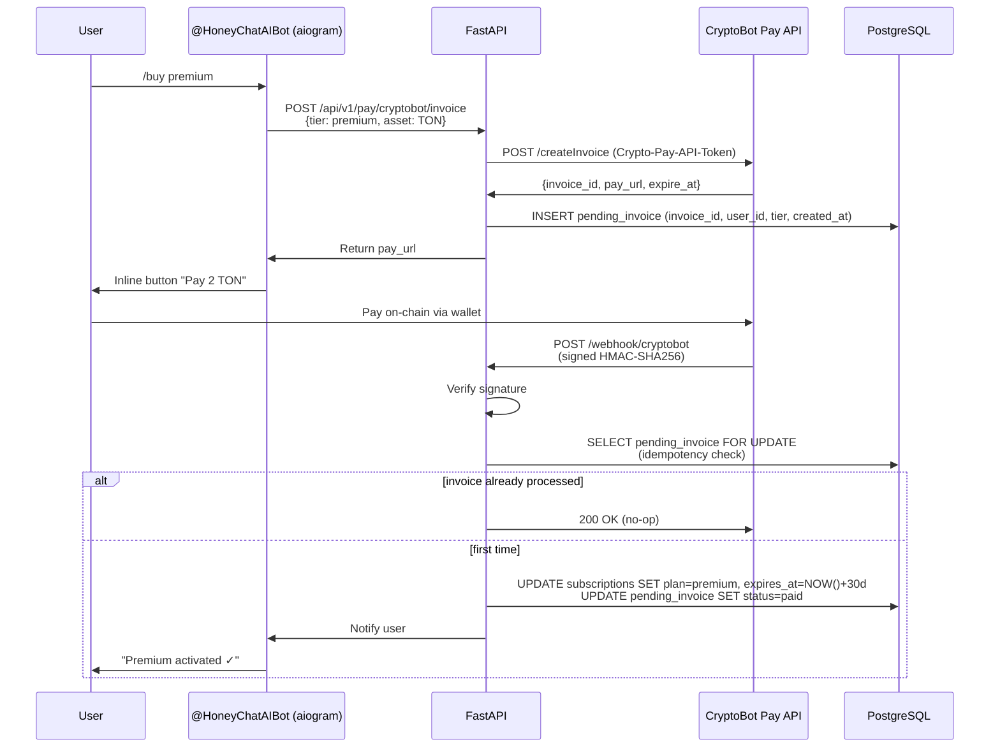

# Case Study: On-chain TON + crypto payments in a production Telegram bot

*After working on LayerZero cross-chain automation ([layerzero-aptos](https://github.com/sm1ck/layerzero-aptos), [TestnetBridge](https://github.com/sm1ck/TestnetBridge)), I integrated on-chain crypto payments into [HoneyChat](https://honeychat.bot) — a production AI companion platform with a Telegram channel ([@HoneyChatAIBot](https://t.me/HoneyChatAIBot)). This document covers the practical architecture, without vendor lock-in advice.*

**Stack touched**: aiogram 3.13 (Telegram bot) · FastAPI (backend) · PostgreSQL · Redis · CryptoBot Pay API · Telegram Stars API

---

## Why dual-rail (fiat + crypto) matters

HoneyChat's paying users split across geographies:
- US / EU / Asia → cards (Paddle as Merchant of Record handles VAT), PayPal
- RU / KZ / BY / Turkey → crypto (cards are frequently declined; Stripe blocked)
- Telegram-native users → Telegram Stars (in-app micro-currency, friction-free)

A single payment rail would miss entire regions. CryptoBot's TON / BTC / ETH / USDT accepts any of these without requiring users to hold a specific asset.

---

## CryptoBot invoice flow



### Key decisions

**1. Idempotency by `invoice_id`, not message hash.** CryptoBot may retry webhook delivery. Use `UPDATE pending_invoice SET status='paid' WHERE invoice_id=$1 AND status='pending' RETURNING *` — if empty result, it's a replay.

**2. Webhook signature verification.** CryptoBot signs payloads with HMAC-SHA256 using your API token. Reject unsigned requests at nginx before reaching FastAPI:

```nginx
location /webhook/cryptobot {
    # Only CryptoBot's IP range
    allow 91.108.4.0/22;
    deny all;
    proxy_pass http://api:8000;
}
```

Then verify in app:

```python
import hmac, hashlib

def verify_cryptobot_signature(secret: str, body: bytes, signature: str) -> bool:
    expected = hmac.new(secret.encode(), body, hashlib.sha256).hexdigest()
    return hmac.compare_digest(expected, signature)
```

**3. Pro-rata tier upgrades.** If a VIP user pays for Elite mid-cycle, don't just overwrite:

```python
remaining_value_old_plan = tier_price(old_plan) * (days_left / 30)
new_plan_days = (amount_paid + remaining_value_old_plan) / (tier_price(new_plan) / 30)
expires_at = now + timedelta(days=new_plan_days)
```

Otherwise users feel cheated and refund.

**4. Geo-arbitrage pricing.** The same Elite tier:
- Card / Paddle: $39.99/mo
- CryptoBot TON: 12 TON (~$35) — small discount compensates user's on-chain gas
- Telegram Stars: 2200 ⭐ (~$38)

Different rails, roughly equivalent value. Users self-select by geography and tolerance.

---

## Dual-path: Stars vs CryptoBot

Telegram Stars and CryptoBot both exist inside Telegram but work very differently:

| | Telegram Stars | CryptoBot |
|---|---|---|
| Settlement | Telegram's ledger (fiat equivalent) | On-chain (real TON/BTC/etc.) |
| User friction | Highest in-app trust, 2 taps | Need funded CryptoBot wallet first |
| Payout to you | 70% after Telegram fee | ~99% (1% CryptoBot fee) |
| Chargeback risk | Low but possible | None (final on-chain) |
| Anon | Pseudonymous to Telegram | Fully on-chain pseudonymous |

HoneyChat shows both. Users in regulated markets prefer Stars (Apple-style micro-txn), crypto-native users go CryptoBot.

---

## What doesn't work

- **Don't use CryptoBot's `Payload` field for anything except `invoice_id` round-trip**. Users can manipulate it before confirmation in some flows.
- **Don't rely on webhook-only delivery**. Poll `/getInvoices?invoice_ids=...` on a 30s interval as safety net for missed webhooks.
- **Don't auto-convert crypto to fiat at CryptoBot**. Their spread is ~2-3%. Withdraw as native asset, convert externally (Bybit / Binance OTC).

---

## If you're building similar

The HoneyChat landing ([honeychat.bot](https://honeychat.bot)) and GitHub ([sm1ck/honeychat](https://github.com/sm1ck/honeychat)) have the full architecture overview — 7-provider OAuth, async FastAPI + aiogram backend, 3-layer memory via Redis + ChromaDB. The CryptoBot integration is one of the payment rails.

For a cross-chain perspective adjacent to this, see [layerzero-aptos](../../README.md) in this repo — different problem (bridging vs. payments), overlapping mental model (idempotency, signature verification, user-facing fee transparency).

---

**Author**: [@sm1ck](https://github.com/sm1ck) · [t.me/haruto_j](https://t.me/haruto_j)
